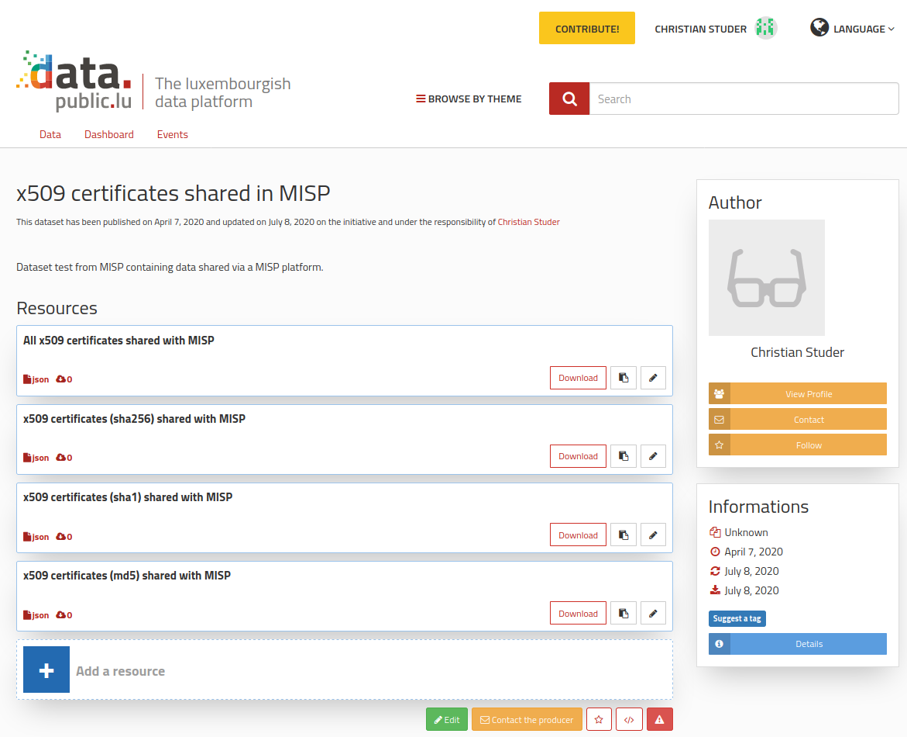

# Publish data on Open data portals with MISP

## The Open data format

Open data defines the idea of making some data freely available for everyone to use with a possibility of redistribution in any form.  
The open data format provides metadata information describing the datasets along with resources stored within the portal.

**Datasets** are the containers used to give a general description of the data stored within the resources.
A dataset has some mandatory fields that must be defined by its creator:
- **title**: A one sentence description to identity the purpose of the dataset
- **description**: A short description giving more details about the dataset
- **update frequency**: The frequency of update for the dataset

Some additional mandatory fields are generated by the portal at the creation or update of the dataset, such as the creation date, the date of last modification or update, the url to the dataset, etc.
Alongside those required fields, users can also add some optional pieces of information to add more specifications to the dataset, such as an acronym, the license used, a temporal or spatial coverage, or the resources.

Each dataset has 2 identifiers:
- **id**: The unique id of the dataset that is set at the creation of the dataset and never changes
- **slug**: The dataset permalink string (its title in lowercase separated by dashes)

Both of those identifiers can be used in a link to access to a dataset.

**Resources** are the containers used within datasets to describe each data collection.
A resource also has mandatory fields:
- **title**: A one sentence description of the data resource
- **type**: The resource type (documentation, main file, API, ...)
- **url**: URL to the data itself
- **format**: Format of the data

As for datasets, some optional fields can also be defined for resources, such as the description of the resource, its release date, its size in bytes, its mime type, etc.

A resource is identified by a unique **id**, that is set at the creation of the resource and never changes.

A dataset can contain multiple resources, and a resource always belongs to a dataset. You can find more information about the format, and the different fields within the [References part](#references)

----

## Use MISP to create, modify or delete data

MISP can be used to make any collection of data from the given instance available on an open data portal.  
To do so, the MISP Search API is used (documentation available within the [References part](#references) as well).  
Users can then create, modify or delete any dataset or resource (as long as they have the right to do so) in the chosen portal.

### General instructions

Regardless of which use case you want to try out, there are a few instructions that must be considered in order to make the interaction with the Open data portal work.

The enpoint to query on MISP's side will always be `opendata.`

The way in which the interaction with the portal is initiated withing MISP is by the use of the MISP API.  
Some API queries, essentially GET calls, are available for everyone and do not require an authentication.  
In our case, we always modify already existing content or create new content on the portal, which requires knowledge about who the to be modified or the newly created data belongs to.  
Thus, an API key will always be needed in order to authenticate with the Open data portal.  
This API key will be provided in your MISP Search queries via the `auth` field (See examples below)

The Open data feature on MISP only supports the Luxembourgish portal for now (notes on the future improvements available [here](#future-improvement)), but as soon as more portals will be supported, the passing of the corresponding urls will also be required.

### Publish data in an Open data portal

Publishing data in an Open data portal implies the creation of both a dataset along with its resource(s) containing the actual data or alternatively, a link pointing to it (details of the format available above within the [Open data format](#the-open-data-format) part).  
But it is also possible to create the dataset and to add resources later.

The _Relative path to query_ value is either `/attributes/restSearch` to make available data collections of MISP attributes, or `/events/restSearch` for complete MISP events.

Here is an example of query that can be used to create a dataset with a resource:
```
{
    "returnFormat": "opendata",
    "type": "x509-fingerprint-md5",
    "tags": "tlp:white",
    "auth": "_YOUR_OPENDATA_PORTAL_API_KEY_",
    "setup": {
        "dataset": {
            "description": "Dataset test from MISP containing data shared via a MISP platform.",
            "title": "x509 certificates shared in MISP"
        },
        "resources": {
            "title": "All x509 certificates shared with MISP",
            "type": "api",
            "format": "json"
        }
    },
    "url": "https://mispriv.circl.lu"
}
```
In this example, we can see the minimum requirement of information needed to interact with the Open data portal:
- `returnFormat` defines the MISP endpoint to query.  
_Required to be set to `opendata`_
- `type` and `tags` are examples of MISP Search specific fields used to filter the data that is going to be share in the Open data portal.  
_Optional non exhaustive list of filters (Look at the [MISP Search API Documentation](https://github.com/MISP/misp-book/tree/master/automation#search) for more filter examples)_
- `auth` contains the required Open data portal API key.  
_Required_
- `setup` contains all the metadata information used to create the dataset and its resource.  
_Should contain at least the [required fields](#the-open-data-format) for datasets (and potentially resources)_
- `url` is the address of the MISP server to use in the link pointing to the data.  
_If not set, the default external base url of the MISP server is used, if set, otherwise the default internal base url._

Within the setup fields, `title` is the one that is used to identify the dataset and the resource.  
**The Open data portal API deals with the datasets and resources `id` fields, but MISP handles this for us, so users only have to provide titles.**  
If a dataset with the same title already exists, it will either create a resource if none exist within the dataset with the same title, or modify the existing resource identified by this title.
In the end, the only difference between a creation and a modification of datasets or resources is defined by the existence (or lack thereof) of a dataset or resource with the same title.

MISP returns a confirmation message with the link of the newly created dataset or resource:
```
Your resource has been successfully created.
It is available under the following link: https://data.public.lu/en/datasets/5e8c91ddd2bfb230a62eb382/#resource-d15c86a9-c907-4977-8cc0-2312c915057e
You can also find the json format equivalent: https://data.public.lu/api/1/datasets/5e8c91ddd2bfb230a62eb382/resources/d15c86a9-c907-4977-8cc0-2312c915057e/
```
Both of the provided links are pointing to the metadata header of the dataset or resource (resource in the example used here).  
The link to the actual data is available then with the `url` field you can find in the metadata header.

If the dataset and/or resource already exists, the query will then post a modification to them, and the confirmation message will be mostly the same:
```
Your resource has been successfully updated.
It is available under the following link: https://data.public.lu/en/datasets/5e8c91ddd2bfb230a62eb382/#resource-d15c86a9-c907-4977-8cc0-2312c915057e
You can also find the json format equivalent: https://data.public.lu/api/1/datasets/5e8c91ddd2bfb230a62eb382/resources/d15c86a9-c907-4977-8cc0-2312c915057e/
```
**Important Note**: Modifying a content (dataset or resource) requires the user to have the right to do so.

### Delete data from an Open data portal

Deleting data from an Open data portal requires less information than what is needed to create or modify some content.  
As we already explained that datasets and resources can be identified by their title, we only need to identify which dataset or resource to delete and thus no longer need to add additional fields in the query.

Which gives us the following example:
```
{
    "returnFormat": "opendata",
    "auth": "_YOUR_OPENDATA_PORTAL_API_KEY_",
    "setup": {
        "dataset": "x509 certificates shared in MISP",
        "resources": [
            "x509 certificates (sha256) shared with MISP",
            "x509 certificates (sha1) shared with MISP",
            "x509 certificates (md5) shared with MISP"
        ],
    },
    "delete": 1
}
```
Only some required fields remain:
- `returnFormat`, as always, to get to the correct MISP endpoint.  
_Required to be set to `opendata`_
- `auth`, as always.  
_Required_
- `setup` which now only contains the dataset, and resource(s) (or not) titles.  
_Should contain a valid dataset title (and potentially valid resource titles)_
- `delete` in order to tell MISP that we want to process a delete query.  
_Required to be set to 1_

Note that if only a dataset title is provided, the portal will be queried for a full dataset delete, which includes all of its resources.  
Alternatively, if at least 1 resource title is provided, it will only delete the referenced resources, and the dataset will still exist, with its potential resources that have not been deleted.

Again a small confirmation message shows the result of the delete query:
```
The resource x509 certificates (sha256) shared with MISP has been deleted from the open data portal.
The resource x509 certificates (sha1) shared with MISP has been deleted from the open data portal.
The resource x509 certificates (md5) shared with MISP has been deleted from the open data portal.
```
----

## Future improvements

List of non-exhaustive possible improvements for the implementation of the Open data feature:
- Make it available for other Open data portals (the support of european national portals are currently being tested, such as the French one). Status of the currently supported portals available [here](https://github.com/misp/misp-opendata/portals_support.md).
- Allow users to upload data collections in the different supported data portals (and deal with the content size limit).
- Enhancement of the parameters handling to support multiple datasets/resources creation in one MISP restSearch query.

## Example of dataset created with MISP



## References

- [data.public.lu API Documentation](https://data.public.lu/fr/apidoc/)
- [MISP Search API Documentation](https://github.com/MISP/misp-book/tree/master/automation#search)
- [MISP opendata source code](https://github.com/MISP/misp-opendata)


